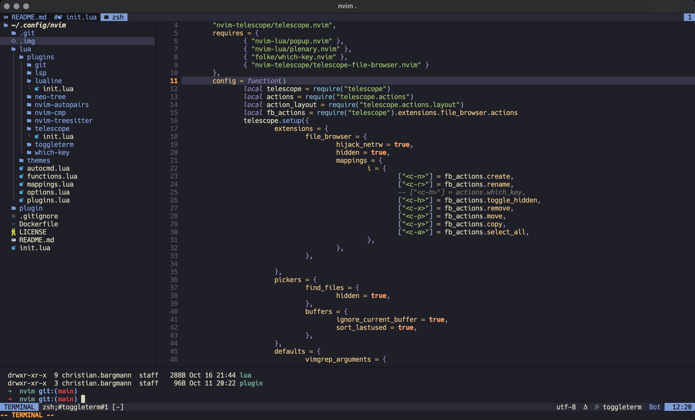

# neovim

>My nvim configuration with the aim of not cluttering nvim with plugins unnecessarily and instead improving the core functions of Vim with some Quality of Life plugins.

<div align="center">

</div>

## Required tools

```bash
# LSP
brew install gopls
brew install hashicorp/tap/terraform-ls
brew install lua-language-server
brew install yaml-language-server
npm install -g dockerfile-language-server-nodejs
npm install -g typescript typescript-language-server

# tools
brew install ripgrep
```

## Plugins

* git
* lsp
* lualine
* neo-tree
* nvim-autopairs
* nvim-cmp
* nvim-treesitter
* telescope
* toggleterm
* which-key

## Acknowledgements

Special Thanks to the following people:

* @allaman
* @alvaroaleman (for sharing your dotfiles with me :D)
* @jan-xyz (for giving me an introduction to `nvim`)
* @snowiow (for making me not giving up on learning `vim`)
